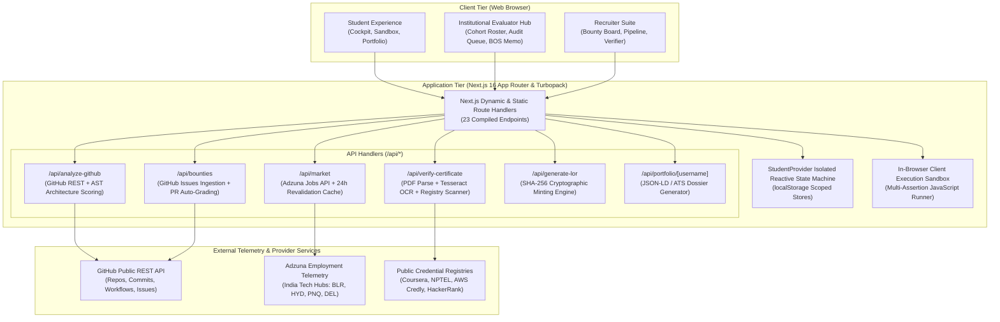
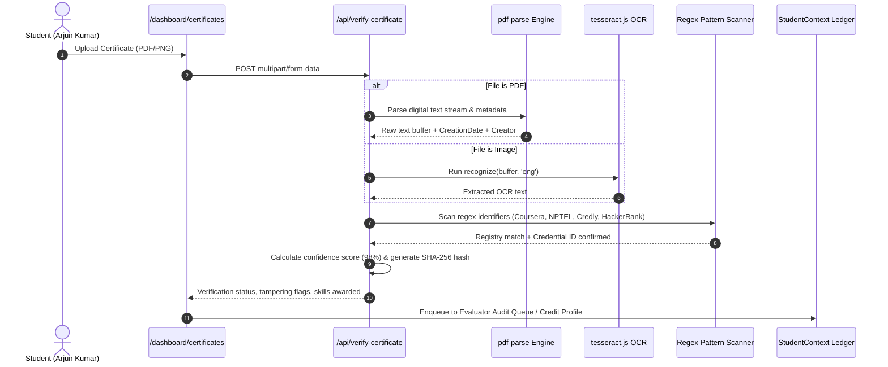

# SkillNexus — System Architecture Specification
### Smart India Hackathon (SIH 2026) | Problem Statement ID: 26044
**AI-Driven Academia-Industry Collaboration & Multi-Source Ground-Truth Verification Platform**

---

## 1. Executive Architectural Overview

Modern technical recruitment and university placement ecosystems suffer from **information asymmetry and resume inflation**. Candidates self-report unverified competencies, while university curricula lag behind rapid industry technology shifts.

**SkillNexus** addresses this via a distributed, multi-source **Ground-Truth Evidence Verification Loop** coupled with an **Institutional Governance & Curriculum Alignment Engine**. The platform bridges students, university administrators (Deans/TPOs), and enterprise tech recruiters on a unified, cryptographically verified ledger.

### Architectural Tenets
1. **Zero-Trust Skill Verification**: No skill node is credited without programmatic or cryptographic evidence (OCR PDF forensics, AST codebase inspection, in-browser runtime assertion, or live PR auto-grading).
2. **Strict Persona & Storage Isolation**: Distinct isolated stores prevent permission leaks and state bleed between Students, Institutional Evaluators, and Corporate Recruiters.
3. **Deterministic Fault-Tolerant Pipelines**: External integrations (GitHub REST API, Adzuna Jobs API) implement 24-hour Next.js edge revalidation caches with deterministic fallback mechanisms.
4. **Cryptographic Integrity (PKI & SHA-256)**: Official Letters of Recommendation (LORs) and bounty completions are hashed and sealed with SHA-256 checksums for instant verification.

---

## 2. High-Level System Architecture (C4 Container View)



---

## 3. Persona State Machine & Storage Isolation Architecture

To eliminate cross-persona cache bleed and protect academic integrity, SkillNexus implements **three isolated data domains** governed by a unified reactive context provider.

```mermaid
graph LR
    subgraph "Active Session Persona Dispatcher"
        P1["Arjun Kumar<br/>(Role: student)"]
        P2["Dr. Sunita Rao<br/>(Role: evaluator / institutional)"]
        P3["Vikram Malhotra<br/>(Role: recruiter)"]
    end

    subgraph "Scoped Immutable Local Storage"
        S_Store["skillnexus_student_data<br/>• Verified Skills<br/>• Certificates<br/>• AST Metrics<br/>• Solved Bounties<br/>• Issued LORs"]
        E_Store["skillnexus_evaluator_data<br/>• Cohort Students (142)<br/>• Pending Audit Queue<br/>• Institutional Metrics<br/>• Department Skill Gaps<br/>• Faculty Directive"]
        R_Store["skillnexus_recruiter_data<br/>• Active Bounties Posted<br/>• Talent Shortlist<br/>• Verification Audit Logs"]
    end

    P1 -->|Reads & Updates| S_Store
    P2 -->|Audits & Governs| E_Store
    P3 -->|Queries & Posts| R_Store

    E_Store -.->|Cross-Persona Write-Through<br/>(Approve Audit Claim)| S_Store
```

### Automatic Routing & Access Matrix

| Persona | Persona ID | Landing Route | Permitted Views | Prohibited Views |
| :--- | :--- | :--- | :--- | :--- |
| **Arjun Kumar** | `arjun-kumar` | `/dashboard` | Student Cockpit, Sandbox, Certificate Upload, GitHub AST, Mock Interview, Team Match, Public Showcase | Evaluator Cockpit (`/dashboard/evaluator`), LOR Minting Console |
| **Dr. Sunita Rao** | `dr-sunita-rao` | `/dashboard/evaluator` | Evaluator Cockpit, Cohort Roster & Triage (`#roster`), Audit Queue (`#audit-queue`), LOR Minting Console (`/dashboard/lor`), Certificate Forensics, BOS Syllabus Memo (`#memo`) | Student Timed Sandbox (`/dashboard/skill-check`), AI Mock Interview |
| **Vikram Malhotra** | `vikram-malhotra` | `/bounties` | Candidate Pipeline, Bounty Marketplace, Cryptographic Verifier, Hiring Market Trends, Public Dossier Showcase | Evaluator Admin Controls, LOR Minting Console |

---

## 4. Multi-Source Ground-Truth Verification Pipelines

### Pipeline 1: AI Certificate Authenticator (`/api/verify-certificate`)


### Pipeline 2: GitHub Ground-Truth AST Analyzer (`/api/analyze-github`)
- **Repository Tree Inspection**: Traverses `.github/workflows` (CI/CD), `Dockerfile` / `docker-compose.yml` (Containerization), `tsconfig.json` (Type Safety), and test configs (`vitest`, `jest`, `pytest`).
- **DevTier Assignment Formula**:
  - `Elite Architect` (Score $ge 90$): Active CI/CD + Docker + TypeScript + Commit Velocity $ge 150$.
  - `Advanced` (Score $75-89$): Modular architecture, multiple languages, clean commit distribution.
  - `Intermediate` (Score $50-74$): Functional codebases with standard documentation.
  - `Novice` (Score $< 50$): Single-commit scripts or template forks.

### Pipeline 3: In-Browser Skill Check Sandbox (`/dashboard/skill-check`)
- **Execution Environment**: Client-side sandboxed `Function` execution runner evaluating real code against multi-input test vectors.
- **Microsecond Benchmarks**: Measures execution duration per test case (e.g., sliding window state persistence under burst load).
- **Instant Crediting**: Triggers celebratory visual feedback (`canvas-confetti`) and writes the verified skill node into `studentStore.skills`.

### Pipeline 4: Market Demand & Syllabus Reform Radar (`/api/market`)
```mermaid
graph TD
    A["Adzuna Jobs REST API (India)"] -->|Query: BLR, HYD, PNQ, DEL| B["Next.js Edge Route Handler (/api/market)"]
    B -->|Cached 24h { next: { revalidate: 86400 } }| C["Aggregate Stack Metrics"]
    D["Deterministic Benchmark Fallback"] -.->|Fallback on API error/rate limit| C
    C --> E["Module 10: Market Demand Radar"]
    C --> F["Module 4: Dynamic Bridge Pathways"]
    C --> G["Evaluator Cockpit: Curriculum Misalignment Radar"]
    G --> H["Board of Studies (BOS) Executive Governance Memo"]
```

---

## 5. Mathematical Formulations

### 5.1 Composite Readiness Score Formula

$$\text{Readiness Score} = \left( 0.40 \times \bar{S}_{\text{verified}} \right) + \left( 0.25 \times Q_{\text{GitHub}} \right) + \left( 0.20 \times \bar{C}_{\text{certs}} \right) + \left( 0.15 \times B_{\text{bounties}} \right)$$

Where:
- $\bar{S}_{\text{verified}}$: Arithmetic mean score across all verified skill nodes ($\in [0, 100]$).
- $Q_{\text{GitHub}}$: Ground-truth codebase quality score from AST architectural analysis ($\in [0, 100]$).
- $\bar{C}_{\text{certs}}$: Mean authenticity confidence score of verified credentials ($\in [0, 100]$).
- $B_{\text{bounties}}$: Bounty bonus index: $\min\left(100, N_{\text{completed}} \times 28 + 40\right)$ where $N_{\text{completed}}$ is verified PR merges.

### 5.2 Curriculum Obsolescence Delta Index

$$\Delta_{\text{obsolescence}} = \frac{\sum_{i=1}^{k} \left| W_{\text{industry}}(i) - W_{\text{syllabus}}(i) \right|}{2 \cdot \sum W_{\text{industry}}} \times 100\%$$

In the current academic session (v2022.4 Syllabus vs. Live Adzuna Demand), the index evaluates to **$42\%$ Delta**, triggering an automated institutional advisory to the Academic Council.

---

## 6. Security, Cryptography & PKI Integrity

1. **SHA-256 Cryptographic Checksums**:
   - Every minted LOR incorporates an immutable transaction hash combining evaluator ID, student roll number, 5-axis rubric ratings, and ISO timestamp:
     $$\text{Hash} = \text{SHA-256}\left( \text{EvaluatorID} \parallel \text{StudentID} \parallel \text{RubricScores} \parallel \text{Timestamp} \right)$$
2. **Anti-Tamper Heuristic Auditing**:
   - Certificates undergo regex validation against official issuer ID formats (e.g., Coursera `[A-Z0-9]{8,14}`, NPTEL `NPTEL\d{2}[A-Z]{2}\d{7,}`).
   - Discrepancies trigger a security audit incident, dropping claim confidence to $42\%$ and alerting the Dean's audit queue.
3. **Role-Based Access Control (RBAC)**:
   - Evaluator controls (`approveAuditClaim`, `flagAuditClaim`, `addIssuedLOR`) are strictly gated to Dr. Sunita Rao (`evaluator` persona).
   - Recruiter controls are strictly restricted to candidate pipelining, verification inspection, and bounty posting.

---

## 7. Build, Verification & Deployment Topology

- **Runtime Target**: Node.js 20+ / Next.js 16.3.4 (App Router with Turbopack, React 19).
- **Styling Architecture**: Tailwind CSS v4 using a strict Linear dark monochrome theme (`#09090b` / `zinc-950` canvas, `zinc-900/50` card containers, `zinc-800` borders, `#10b981` emerald accent).
- **Route Compilation**: 23 static & dynamic routes compiled with **0 TypeScript and lint errors**.
- **Automated Verification**: End-to-end API test harness in `scripts/test-modules.mjs` verifying Modules 7 and 10 under live and fallback conditions.
- **Repository**: Hosted at [`SERPoG31/sih-prototype`](https://github.com/SERPoG31/sih-prototype).
