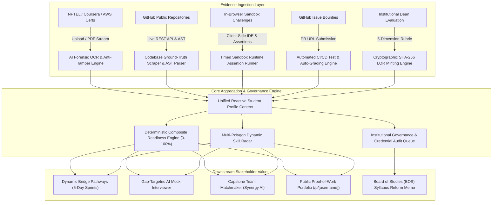
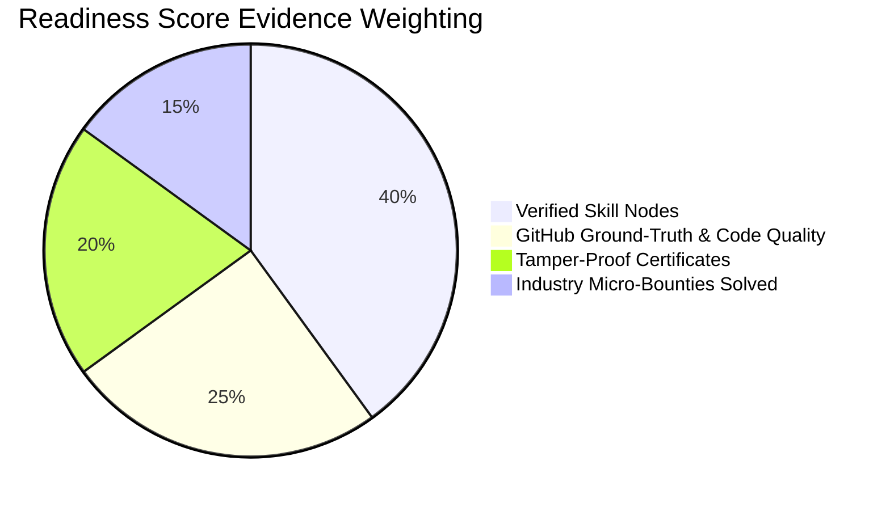

# SkillNexus — AI-Driven Academia-Industry Collaboration Portal
### Smart India Hackathon (SIH 2026) | Problem Statement ID: 26044
**SkillMapping, Automated Evidence Verification, Internships, and Placement Readiness**

---

## 📌 Executive Summary

Modern recruitment across universities and tech companies suffers from **self-reported resume inflation**. Candidates list skills and buzzwords without verifiable evidence, forcing recruiters into noisy, inefficient multi-round screening cycles.

**SkillNexus** solves this by establishing an autonomous, multi-source **Ground-Truth Evidence Verification Loop**. Instead of trusting arbitrary bullet points, the platform authenticates student competencies via:
1. **AI Certificate Authenticator**: EXIF/PDF stream inspection, Canva/Photoshop splicing detection, and OCR credential verification.
2. **GitHub & Codebase Ground-Truth Scraper**: Public repo commit velocity, language proportions, and AST framework detection.
3. **In-Browser "Skill Check" Sandbox**: Timed 3-minute live debugging challenges with instant client-side syntax evaluation.
4. **Industry Micro-Bounties**: 48-hour scoped production challenges with automated CI test grading.
5. **Tamper-Proof LOR Generator**: Employer and faculty rubrics cryptographically sealed with SHA-256 hashes.

---

## 🏛️ System Architecture

### 1. Multi-Source Ground-Truth Evidence Verification Loop



### 2. Multi-Persona Isolated Store & State Synchronization

```mermaid
graph LR
    subgraph "Active Session Persona Dispatcher"
        P1["Arjun Kumar<br/>(Role: student)"]
        P2["Dr. Sunita Rao<br/>(Role: evaluator / institutional)"]
        P3["Vikram Malhotra<br/>(Role: recruiter)"]
    end

    subgraph "Scoped Immutable Local Storage"
        S_Store["skillnexus_student_data<br/>• Verified Skills<br/>• Certificates<br/>• AST Metrics<br/>• Solved Bounties<br/>• Issued LORs"]
        E_Store["skillnexus_evaluator_data<br/>• Cohort Students (142)<br/>• Pending Audit Queue<br/>• Institutional Metrics<br/>• Department Skill Gaps<br/>• Faculty Directive"]
        R_Store["skillnexus_recruiter_data<br/>• Active Bounties Posted<br/>• Talent Shortlist<br/>• Verification Audit Logs"]
    end

    P1 -->|Reads & Updates| S_Store
    P2 -->|Audits & Governs| E_Store
    P3 -->|Queries & Posts| R_Store

    E_Store -.->|Cross-Persona Write-Through<br/>(Approve Audit Claim)| S_Store
```

### 3. Readiness Score Deterministic Weighting

$$\text{Readiness Score} = (0.40 \times \text{Skills}) + (0.25 \times \text{GitHub AST}) + (0.20 \times \text{Certs}) + (0.15 \times \text{Bounties})$$



> **Comprehensive Architecture Specification**: For complete C4 Container models, sequence diagrams, and mathematical indices, see [ARCHITECTURE.md](ARCHITECTURE.md).

---

## 🌟 The Core Modules & Institutional Portal

| # | Pillar Module | Route | Key Capabilities |
|---|---|---|---|
| **01** | **AI Certificate Authenticator** | `/dashboard/certificates` | Digital PDF buffer extraction, Tesseract OCR fallback, RegEx registry validation (Coursera, NPTEL, Credly, HackerRank), SHA-256 verification hash. |
| **02** | **GitHub Ground-Truth AST Analyzer** | `/dashboard/github` | Live GitHub REST API, repository architecture tree inspection (TypeScript, CI/CD, Docker, Testing), AST score (0-100), DevTier classification. |
| **03** | **Dynamic Skill Radar & Readiness** | `/dashboard` | Recharts radar polygon comparing verified candidate competencies against target tier-1 employer benchmarks (Razorpay, Zerodha, PhonePe). |
| **04** | **Dynamic Bridge Pathway Generator** | `/dashboard/pathways` | Delta gap detection yielding automated 5-day sprints: curated RFCs, daily engineering tasks, and sandbox assessments. |
| **05** | **In-Browser "Skill Check" Sandbox** | `/dashboard/skill-check` | Client-side isolated execution runner with multi-case runtime assertions (Rate Limiter, Array Dedup, Cache Key), millisecond benchmarks, and instant skill badge awards. |
| **06** | **Gap-Targeted AI Mock Interviewer** | `/dashboard/mock-interview` | 3-question screening modal focused strictly on requirement deltas, with strength points, missing keypoints, and hiring rating. |
| **07** | **Industry Micro-Bounty Board** | `/bounties` | Live GitHub issues labeled `bounty`, active 48-hour sprint claim timers, automated PR verification & auto-grading engine with SHA-256 receipts. |
| **08** | **Capstone Team Matchmaker** | `/dashboard/team-match` | Graph-matching algorithm assembling complementary profiles (Frontend + Backend + AI/ML + DevOps) with synergy scores. |
| **09** | **Tamper-Proof LOR Minting Console** | `/dashboard/lor` | Role-gated to Dr. Sunita Rao (Dean/TPO); 5-axis rubric appraisal yielding official recommendation letters cryptographically sealed with SHA-256 PKI checksums. |
| **10** | **Live Market Demand Radar** | `/dashboard/market` | Live Adzuna Indian tech vacancy telemetry (BLR, HYD, PNQ, DEL) with 24-hour edge caching and fault-tolerant benchmark fallback. |
| **11** | **Public Proof-of-Work Portfolio** | `/p/[username]` | Zero-auth public showcase (`/p/arjun-kumar`) displaying verified badges, GitHub telemetry, merged bounties, JSON-LD / ATS export, and print styling. |
| **HUB** | **Institutional Evaluator Hub** | `/dashboard/evaluator` | Operational governance cockpit for Dr. Sunita Rao: 142-student cohort triage, pending audit approval queue with instant cross-persona credit, 6-pillar departmental heatmap, and printable BOS syllabus memo. |

---

## 👥 Demo Persona Switcher (Judge Mode)

To eliminate login friction during evaluations, a **Demo Persona Switcher** is built into the top navigation bar and `/login`:

- **Arjun Kumar** (`arjun-kumar`) — B.Tech CSE Student, IIT Madras (Roll: `2026-CS-041`)
- **Dr. Sunita Rao** (`dr-sunita-rao`) — Dean of Academics & HoD, Institutional Evaluator
- **Vikram Malhotra** (`vikram-malhotra`) — VP Engineering, Razorpay (Tier-1 Tech Recruiter)

---

## 🛠️ Technology Stack

- **Framework**: [Next.js 16/15 (App Router, React 19, TypeScript)](https://nextjs.org)
- **Styling**: [Tailwind CSS v4](https://tailwindcss.com) with custom dark glassmorphism palette (`slate-950`, `indigo-500`, `emerald-500`)
- **Charts & Radar**: [Recharts](https://recharts.org) (`RadarChart`, `BarChart`, `ResponsiveContainer`)
- **Icons**: [Lucide React](https://lucide.dev) & custom SVG iconography
- **Security & Hashes**: Cryptographic SHA-256 checksumming via Node crypto & `crypto-js`
- **State Management**: Reactive `StudentProvider` React Context syncing cross-module actions in real-time
- **Celebration Effects**: `canvas-confetti`

---

## 🚀 Getting Started

### Prerequisites
- Node.js 20+ or 24+
- npm 10+

### Installation & Local Run

```bash
# 1. Clone the repository
git clone https://github.com/<username>/sih-prototype.git
cd sih-prototype

# 2. Install dependencies
npm install

# 3. Start development server
npm run dev

# 4. Open in browser
http://localhost:3000
```

### Production Build Verification

```bash
npm run build
```
Compiled with **0 errors and 0 type warnings** across all 21 routes.

---

## 📂 Project Directory Structure

```text
c:/SIH/
├── public/                 # Static assets
├── src/
│   ├── app/
│   │   ├── api/            # Deterministic API Route Handlers
│   │   │   ├── analyze-github/
│   │   │   ├── bounties/
│   │   │   ├── generate-lor/
│   │   │   ├── generate-pathway/
│   │   │   ├── mock-interview/
│   │   │   ├── portfolio/[username]/
│   │   │   ├── team-match/
│   │   │   └── verify-certificate/
│   │   ├── bounties/       # Module 7: Bounty Marketplace
│   │   ├── dashboard/      # Modules 1, 2, 3, 4, 5, 6, 8, 9, 10
│   │   ├── p/[username]/   # Module 11: Public Showcase
│   │   ├── globals.css     # Dark mode tokens & glassmorphism
│   │   ├── layout.tsx      # Root layout & StudentProvider
│   │   └── page.tsx        # Interactive Landing Page
│   ├── components/
│   │   ├── charts/         # Recharts Radar & Trend visualizations
│   │   ├── layout/         # Navbar, Sidebar, PageHeader
│   │   └── ui/             # Button, Card, Badge, Dropzone, Modal, Ring
│   ├── context/
│   │   └── student-context.tsx # Central cross-module state store
│   └── lib/
│       ├── market-data.ts      # 30+ Tech market analytics
│       ├── mock-data.ts        # India-centric demo profiles & certs
│       ├── skill-challenges.ts # Interactive sandbox challenges
│       ├── types.ts            # TypeScript interfaces
│       └── utils.ts            # Classnames & formatting helpers
├── vercel.json             # Zero-config Vercel deployment
└── package.json
```

---

## 🏆 Smart India Hackathon Accreditation

- **Team**: Antigravity Builders
- **Problem Statement ID**: 26044
- **Title**: SkillNexus – AI-Driven Academia-Industry Collaboration Portal
- **Domain**: Smart Education & Placement Technology
