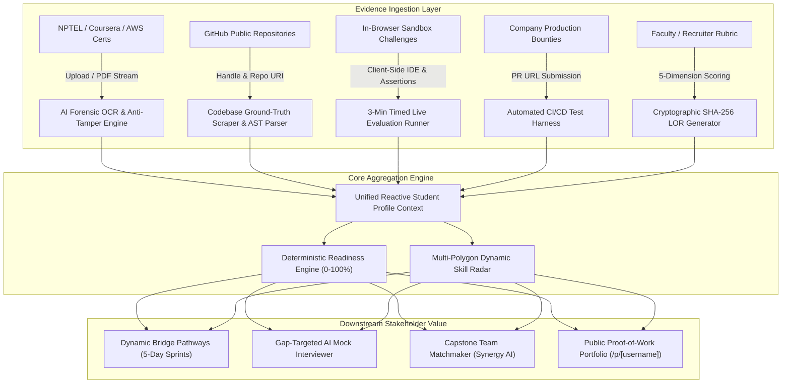
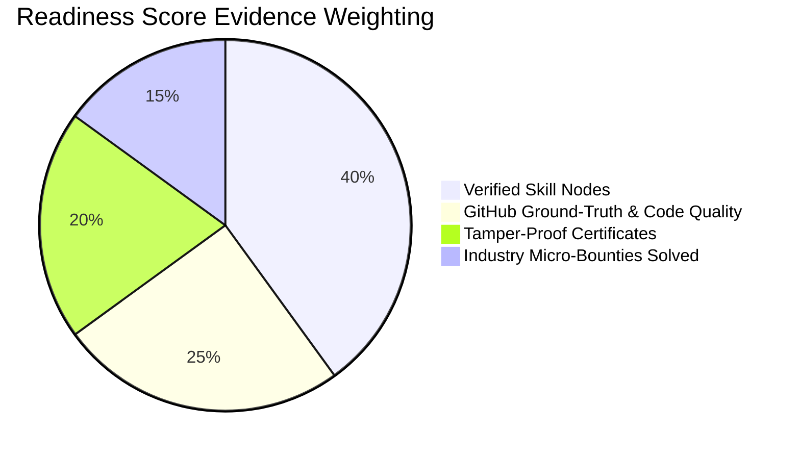

# SkillNexus — AI-Driven Academia-Industry Collaboration Portal
### Smart India Hackathon (SIH 2026) | Problem Statement ID: 26044
**SkillMapping, Automated Evidence Verification, Internships, and Placement Readiness**

---

## 📌 Executive Summary

Modern recruitment across universities and tech companies suffers from **self-reported resume inflation**. Candidates list skills and buzzwords without verifiable evidence, forcing recruiters into noisy, inefficient multi-round screening cycles.

**SkillNexus** solves this by establishing an autonomous, multi-source **Ground-Truth Evidence Verification Loop**. Instead of trusting arbitrary bullet points, the platform authenticates student competencies via:
1. **AI Certificate Authenticator**: EXIF/PDF stream inspection, Canva/Photoshop splicing detection, and OCR credential verification.
2. **GitHub & Codebase Ground-Truth Scraper**: Public repo commit velocity, language proportions, and AST framework detection.
3. **In-Browser "Skill Check" Sandbox**: Timed 3-minute live debugging challenges with instant client-side syntax evaluation.
4. **Industry Micro-Bounties**: 48-hour scoped production challenges with automated CI test grading.
5. **Tamper-Proof LOR Generator**: Employer and faculty rubrics cryptographically sealed with SHA-256 hashes.

---

## 🏛️ System Architecture

### 1. Ground-Truth Verification Loop



### 2. Readiness Score Deterministic Weighting



---

## 🌟 The 11 Core Modules

| # | Pillar Module | Route | Key Capabilities |
|---|---|---|---|
| **01** | **AI Certificate Authenticator** | `/dashboard/certificates` | Forensic PDF stream analysis, Canva/Photoshop splicing checks, OCR metadata extraction, on-ledger SHA-256 verification hash, 1-click test presets. |
| **02** | **GitHub Ground-Truth Scraper** | `/dashboard/github` | AST framework extraction (Next.js 15, FastAPI, Docker), commit velocity, language proportions, and verified "Dev Tier" classification. |
| **03** | **Dynamic Skill Radar & Readiness** | `/dashboard` | Recharts radar chart comparing candidate verified polygon against target employer benchmarks (Razorpay, Zerodha, PhonePe). |
| **04** | **Dynamic Bridge Pathway Generator** | `/dashboard/pathways` | Delta gap detection yielding automated 5-day sprints: curated RFCs, daily engineering tasks, and sandbox assessments. |
| **05** | **In-Browser "Skill Check" Sandbox** | `/dashboard/skill-check` | Timed 3-minute code editor with test assertions (React hook concurrency, SQL index optimization, Docker multi-stage builds) and instant badge award. |
| **06** | **Gap-Targeted AI Mock Interviewer** | `/dashboard/mock-interview` | 3-question screening modal focused strictly on requirement deltas, with strength points, missing keypoints, and hiring rating. |
| **07** | **Industry Micro-Bounty Board** | `/bounties` | 48-hour scoped production challenges from Razorpay, Zerodha, and PhonePe with automated CI test harness scoring on PR submissions. |
| **08** | **Capstone Team Matchmaker** | `/dashboard/team-match` | Graph-matching algorithm assembling complementary profiles (Frontend + Backend + AI/ML + DevOps) with synergy scores. |
| **09** | **Tamper-Proof AI LOR Generator** | `/dashboard/lor` | 5-star rubric appraisal yielding official recommendation letters cryptographically signed and checksummed with SHA-256. |
| **10** | **Live Market Demand Radar** | `/dashboard/market` | Analytics on 12,000+ Indian job openings comparing surging skills (GenAI +182%, Rust +94%) against deprecated tech (AngularJS 1.x, PHP 5, Flash). |
| **11** | **Public Proof-of-Work Portfolio** | `/p/[username]` | Zero-auth public showcase (`/p/arjun-kumar`) displaying verified badges, GitHub telemetry, merged bounties, and skill radar polygons. |

---

## 👥 Demo Persona Switcher (Judge Mode)

To eliminate login friction during evaluations, a **Demo Persona Switcher** is built into the top navigation bar:

- **Arjun Kumar** — Pre-Final Year CSE Student, IIT Madras (Applicant Profile)
- **Priya Sharma** — Senior Tech Recruiter @ Razorpay Fintech India
- **Dr. K. Ramanathan** — Head of Training & Placements, IIT Madras CSE Department

---

## 🛠️ Technology Stack

- **Framework**: [Next.js 16/15 (App Router, React 19, TypeScript)](https://nextjs.org)
- **Styling**: [Tailwind CSS v4](https://tailwindcss.com) with custom dark glassmorphism palette (`slate-950`, `indigo-500`, `emerald-500`)
- **Charts & Radar**: [Recharts](https://recharts.org) (`RadarChart`, `BarChart`, `ResponsiveContainer`)
- **Icons**: [Lucide React](https://lucide.dev) & custom SVG iconography
- **Security & Hashes**: Cryptographic SHA-256 checksumming via Node crypto & `crypto-js`
- **State Management**: Reactive `StudentProvider` React Context syncing cross-module actions in real-time
- **Celebration Effects**: `canvas-confetti`

---

## 🚀 Getting Started

### Prerequisites
- Node.js 20+ or 24+
- npm 10+

### Installation & Local Run

```bash
# 1. Clone the repository
git clone https://github.com/<username>/sih-prototype.git
cd sih-prototype

# 2. Install dependencies
npm install

# 3. Start development server
npm run dev

# 4. Open in browser
http://localhost:3000
```

### Production Build Verification

```bash
npm run build
```
Compiled with **0 errors and 0 type warnings** across all 21 routes.

---

## 📂 Project Directory Structure

```text
c:/SIH/
├── public/                 # Static assets
├── src/
│   ├── app/
│   │   ├── api/            # Deterministic API Route Handlers
│   │   │   ├── analyze-github/
│   │   │   ├── bounties/
│   │   │   ├── generate-lor/
│   │   │   ├── generate-pathway/
│   │   │   ├── mock-interview/
│   │   │   ├── portfolio/[username]/
│   │   │   ├── team-match/
│   │   │   └── verify-certificate/
│   │   ├── bounties/       # Module 7: Bounty Marketplace
│   │   ├── dashboard/      # Modules 1, 2, 3, 4, 5, 6, 8, 9, 10
│   │   ├── p/[username]/   # Module 11: Public Showcase
│   │   ├── globals.css     # Dark mode tokens & glassmorphism
│   │   ├── layout.tsx      # Root layout & StudentProvider
│   │   └── page.tsx        # Interactive Landing Page
│   ├── components/
│   │   ├── charts/         # Recharts Radar & Trend visualizations
│   │   ├── layout/         # Navbar, Sidebar, PageHeader
│   │   └── ui/             # Button, Card, Badge, Dropzone, Modal, Ring
│   ├── context/
│   │   └── student-context.tsx # Central cross-module state store
│   └── lib/
│       ├── market-data.ts      # 30+ Tech market analytics
│       ├── mock-data.ts        # India-centric demo profiles & certs
│       ├── skill-challenges.ts # Interactive sandbox challenges
│       ├── types.ts            # TypeScript interfaces
│       └── utils.ts            # Classnames & formatting helpers
├── vercel.json             # Zero-config Vercel deployment
└── package.json
```

---

## 🏆 Smart India Hackathon Accreditation

- **Team**: Antigravity Builders
- **Problem Statement ID**: 26044
- **Title**: SkillNexus – AI-Driven Academia-Industry Collaboration Portal
- **Domain**: Smart Education & Placement Technology
